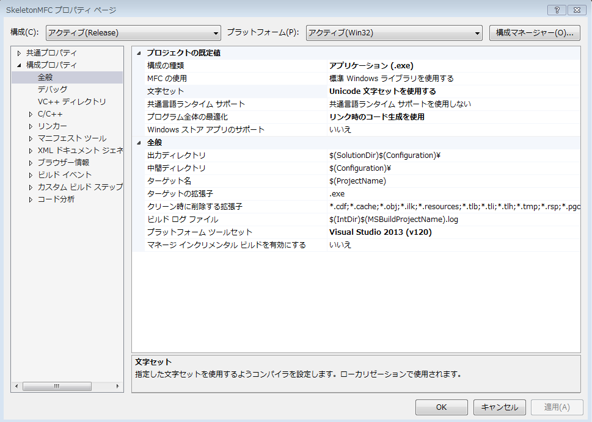
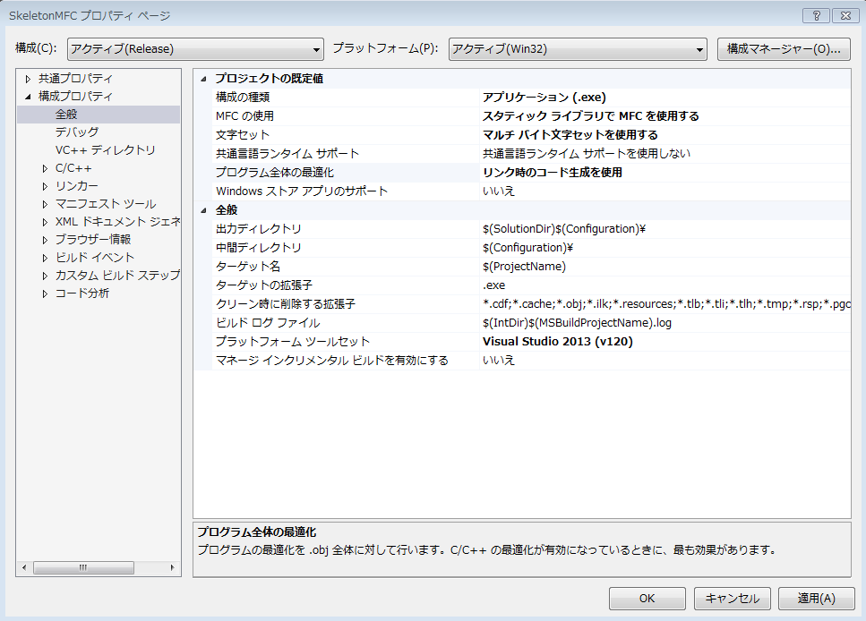

Skeleton MFC Project
=====

MFCを用いたGUIプログラムのスケルトンコードです．
このプロジェクトをもとにしてMFCを用いたGUIプログラムを作成することができます．

## 概要
CWinAppを継承したアプリケーションクラスとCFrameWndを継承したウィンドウクラスの
2つから成り立っています．

空のWin32APIプロジェクトを作成し，[構成プロパティ]-[プロジェクトの既定値]から
MFCの使用，文字セットをそれぞれ変更します．

## コンパイル
スケルトンコードはVisual Studio 2013のコンパイラを使用しています．
他のコンパイラでは試していませんが，おそらく動作すると思います．

## 使用法

このプロジェクトをcloneしてVisual Studioでコンパイルしてください．

	git clone https://github.com/westoshy/SkeletonMFC.git
